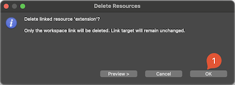

# Firmware Silicon Labs xG24 Dev Kit

Edge Impulse enables developers to create the next generation of intelligent device solutions with embedded machine learning. This repository contains the Edge Impulse firmware for Silicon Labs EFR32xG24 Dev Kit. This device supports all of Edge Impulse's device features, including ingestion, remote management and inferencing.

> **Note:** Do you just want to use this development board to collect data with Edge Impulse? No need to build this firmware. View the [getting started guide](https://docs.edgeimpulse.com/docs/silabs-xg24-dev-kit) for a pre-built firmware image and flashing instructions. Or, you can use the [data forwarder](https://docs.edgeimpulse.com/docs/cli-data-forwarder) to capture data from any sensor.

## Requirements

### Hardware

* [EFR32xG24 Dev Kit](https://www.silabs.com/wireless/zigbee/efr32mg24-series-2-socs)
* (optional) [Arducam Mini 2MP PLUS](https://www.arducam.com/product/arducam-2mp-spi-camera-b0067-arduino/)

### Software

* [SLC CLI Tools](https://www.silabs.com/documents/public/user-guides/ug520-software-project-generation-configuration-with-slc-cli.pdf)
* [GNU Arm Embedded Toolchain 10-2020-q4-major](https://developer.arm.com/tools-and-software/open-source-software/developer-tools/gnu-toolchain/gnu-rm/downloads)
* [Gecko SDK v4.0.2](https://github.com/SiliconLabs/gecko_sdk/tree/v4.0.2)
* [Simplicity Commander](https://community.silabs.com/s/article/simplicity-commander?language=en_US)
* [Edge Impulse CLI](https://docs.edgeimpulse.com/docs/cli-installation)

## How to build

### Command Line build (Linux)

1. Clone the [Gecko SDK v.4.0.2](https://github.com/SiliconLabs/gecko_sdk/tree/v4.0.2)

    ```
    git clone -b v4.0.2 https://github.com/SiliconLabs/gecko_sdk.git
    ```

1. Install [SLC CLI Tools (see p. 2.1)](https://www.silabs.com/documents/public/user-guides/ug520-software-project-generation-configuration-with-slc-cli.pdf)
1. Configure `SLC CLI` to point the location of the `Gecko SDK` and sign the SDK

    ```
    slc configuration --sdk /home/user/gecko_sdk/
    slc signature trust --sdk /home/user/gecko_sdk/
    ```

1. Also configure the default location of your toolchain, eg.

    ```
    slc configuration --gcc-toolchain /opt/toolchains/gcc-arm-none-eabi-10-2020-q4-major
    ```

1. Clone this repo and build

    ```
    git clone git@github.com:edgeimpulse/firmware-silabs-xg24.git
    cd firmware-silabs-xg24/
    ./build.sh --build
    ```

### Using Docker

1. Build the container

    ```
    $ docker build -t edge-impulse-silabs-xg24 .
    ```

1. Build the application

    ```
    docker run --rm -v $PWD:/app edge-impulse-silabs-xg24 /bin/bash build.sh --clean --build
    ```

### Using Simplicity Studio v5

1. Install [Simplicity Studio v5](https://www.silabs.com/developers/simplicity-studio) and [Gecko SDK v4.0.2](https://github.com/SiliconLabs/gecko_sdk)
1. Clone this repository
1. In the Simplicity Studio, choose `File -> Import`

    

1. Browse to the directory with cloned repository and select `firmware-xg24` project

    

1. On the next step, you will see error that the device part of the build configuration cannot be resolved, ingore it and go to next step

    

1. In the `Boards` section, select (type in) `BRD2601B` and make sure to select Gecko SDK 4.0.2

    

1. Choose a project name in your workspace and finish

    

1. We have to make a small tweak. In the `Project Explorer` panel, right click on the `ei-model` directory and choose `Delete`

    

1. Confirm that only workspace link will be removed, the target will remain unchanged

    

1. Now, double click on the `firmware-xg24.slcp` file to open project configuration

    

1. In the new window click `Force Regeneration`

    

1. Build the project

    

## Flashing

1. Install [Simplicity Commander](https://community.silabs.com/s/article/simplicity-commander?language=en_US)
1. Connect the board, run `Commander` and flash the following hex file

    ```
    firmware-silabs-xg24/build/debug/firmware-silabs-xg24.hex
    ```
